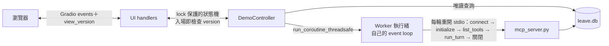

# 任務：HRMS 請假 Agent 的 Gradio 對話 Demo

- **編號**：#6（對應 coordination.md）
- **負責 agent**：claude
- **分支**：`feat/hrms-gradio-demo`
- **狀態**：IN PROGRESS（里程碑 1～3 完成，瀏覽器三情境手動通過；待里程碑 4：防呆 checklist、README）

## 目標

agent 班成果發表（2026-10-13，簡報＋demo 畫面）需要可以在瀏覽器操作的畫面：一句話請假、按鈕確認、同一畫面看到請假週曆與額度變化。終端機版（任務 #5）的行為與安全保證不能退步。

## 設計

### 範圍

**做**：瀏覽器聊天介面、送出／取消按鈕取代 y/N、員工切換（僅閒置時）、請假週曆（本週＋下週）、該員工額度快照、啟動參數 `--reset-db`（啟動前重建資料庫）。「今天」固定 2026-09-13，與模型名稱一起顯示在標題列。

**不做**：多人同時使用、登入、公開分享連結（`share=True`）、部署、串流逐字輸出、等待確認時切換員工、UI 上的重建資料庫按鈕、稽核紀錄面板、改服務層或 MCP Server、真正的排班資料（班表資料表、「只能請有排班時段」規則）。

### 1. 確認流程：confirm 可以是 async（不拆 `run_turn`）

- `agent_app.Confirm` 改為 `Callable[[str], bool | Awaitable[bool]]`；`dispatch_tool_call` 呼叫後以 `inspect.isawaitable()` 判斷，是就 `await`。
- 結果只有 `is True` 算同意（awaitable 忘了 await、回傳非布林值都算拒絕）。
- 凍結參數 → `preview_leave` → 顯示 → 同一份參數 `apply_leave` 的安全鏈完全沿用。終端機版 `terminal_confirm` 與 CLI 行為不變。

### 2. 架構



- **Worker 執行緒＋獨立 event loop**：跨兩次按鈕事件要有一個「暫停中的 turn」與它等待的 `Future`；Gradio handler 的 loop／task 生命週期不可依賴，`gr.State` 也不能放 Future／Lock。Worker loop 只跑 turn，不持有長連線。
- **每輪重開 MCP stdio**：狀態都在 SQLite，不依賴 transport 長連線。
- **對話歷史**：`messages` 由 controller 持有，只在 worker loop 內被 `run_turn` 修改；切換員工只在 `IDLE` 時由 controller 清空。

### 3. Controller 狀態機與入場控制

**狀態**

| 狀態 | 允許操作 | 轉移 |
|---|---|---|
| `IDLE` | `send`、`switch_employee` | `send` → `BUSY`（配發新 `turn_id`） |
| `BUSY` | 無（只等事件） | `NeedConfirm` → `AWAIT_CONFIRM`；`Reply` → `IDLE`；可恢復錯誤 → 回滾後 `IDLE`；致命錯誤 → `FATAL` |
| `AWAIT_CONFIRM` | `answer(approved)` | → `BUSY` |
| `CLOSING`／`FATAL` | 無 | 終點 |

**入場控制（admission control）**：Gradio 共用 `concurrency_limit=1` 只是「排隊」，不是「點擊當下拒絕」；BUSY 時點的第二個操作可能排到下一輪 `IDLE` 才執行。因此：

- Controller 維護單調遞增的 `version`，**每次狀態轉移都 +1**。
- 每次 UI 更新都把目前 `version` 寫進一個隱藏元件；每個事件都把它當輸入送回。
- 所有操作在 `threading.Lock` 下檢查：`事件帶的 version == 目前 version` 且狀態允許，才轉移；否則回傳目前畫面、不做任何事。
- 效果：BUSY 期間排隊的送出、切換員工、確認連點，帶的都是舊 version，輪到它們時一律被拒。
- 前提（實作時以 6.27 原始碼／手動驗證）：Gradio 在觸發當下擷取輸入值，而不是輪到執行時才讀。若不成立，改在 `send`／`answer` 回傳前以 `queue=False` 的 gate handler 立即轉態。

**事件**：`NeedConfirm(turn_id, text)`、`Reply(turn_id, text)`、`Error(turn_id, message, fatal)`，放進 controller 的 `queue.Queue`；handler 只接受目前 `turn_id` 的事件。

**answer 的通道**：`answer` 通過入場檢查後，只呼叫 `loop.call_soon_threadsafe(resolve_pending, turn_id, approved)`；「檢查 Future 是否仍存在且未完成＋`set_result`」整段在 worker loop 內執行，不在 UI 執行緒做 `done()` 檢查。

### 4. Worker：逾時、錯誤分類、回滾、關閉

**每輪流程與逾時**（Python 3.13 `asyncio.timeout`）

1. 記錄 checkpoint：`checkpoint = len(messages)`。
2. 啟動階段（上限 `STARTUP_TIMEOUT = 30s`）：用 `AsyncExitStack` 進入 `stdio_client` 與 `ClientSession`，`initialize()`、`list_tools()`。
3. `run_turn`：
   - Anthropic 呼叫：SDK 自帶逾時與重試。
   - MCP 工具呼叫：session 包一層 `call_tool` 加 `asyncio.wait_for(…, TOOL_TIMEOUT = 60s)`；逾時由既有 `call_tool_safely` 轉成 `TOOL_CALL_ERROR` 交回 LLM，turn 照常繼續。
   - 等待使用者確認：**不設逾時**（人在看畫面）。
4. 關閉階段：離開 `AsyncExitStack`，走下方「子行程強制終止」的兩段截止；成功清掉 PID 檔才算本輪乾淨結束，否則強制終止後以可恢復 `Error` 結束本輪。
5. 最外層保證每個 turn 都以 `Reply` 或 `Error` 結束；`finally` 若仍有 pending confirm Future，以 `False` 解決。

**錯誤分類（demo 專用，不改 CLI 的 `describe_api_error`）**

| 類別 | 例子 | 處理 |
|---|---|---|
| 致命 | 找不到認證（`TypeError` 認證訊息）、401、404 模型不存在、worker loop 已停止 | `Error(fatal=True)` → `FATAL`，顯示原因與「修正 .env 後重啟」 |
| 請求無效 | 400 | **清空整段對話歷史** → `IDLE`，提示「對話已重置，請重新描述」 |
| 可恢復 | 429、5xx、連線錯誤、啟動／關閉逾時、MCP 初始化失敗、其他程式例外 | `del messages[checkpoint:]` 回滾本輪 → `IDLE`，提示再試一次；程式例外另記 log |

回滾的理由：`run_turn` 會邊跑邊 append user、assistant tool_use、tool_result；中途失敗若不回滾，下輪會帶著半套 tool_use 送出而 400。`messages` 是 controller 唯一的對話狀態，回滾＋解決 pending Future 後 invariant 即恢復，才可回 `IDLE`。

**子行程強制終止（取消不是硬上限）**

`asyncio.timeout`／`cancel()` 觸發後，cleanup 仍要跑完才會結束，某個 `__aexit__` 卡住就沒有上限；MCP stdio transport 只有在自己的 `finally` 跑完時才保證終止子行程，而它不對外提供 PID，venv 也沒有 `psutil`。因此：

- **PID 檔**：demo 不直接啟動 `mcp_server.py`，改啟動 `demo_server_launcher.py <pid_file>`：先把 `os.getpid()` 寫入該輪專屬的暫存 PID 檔，再以 `runpy.run_path("mcp_server.py", run_name="__main__")` 在**同一個行程**執行 Server。`mcp_server.py` 不改。
- **正常結束**：`AsyncExitStack` 退出後刪除 PID 檔。
- **兩段截止**（每輪關閉與程式關閉共用）：
  1. 寬限：等 cleanup 完成，上限 `SHUTDOWN_GRACE = 10s`。
  2. 取消：逾時則 `cancel()`，再等取消後的 cleanup，上限 `CANCEL_GRACE = 5s`。
  3. 強制：仍未完成或 PID 檔仍在 → 讀 PID 檔強制終止行程樹（Windows `taskkill /PID <pid> /T /F`；POSIX `os.killpg`／`os.kill(SIGKILL)`），「行程不存在」視為成功，記 warning log，刪 PID 檔。**不在 Windows 上用 `os.kill(pid, 0)` 探測**（Windows 的 `os.kill` 會直接 TerminateProcess）。
- PID 重用風險：只在 PID 檔仍存在（cleanup 從未完成）時才強制終止，且 PID 檔在該輪結束就刪除，視窗極短；demo 可接受。

**關閉流程**（`launch()` 外層 `try/finally`）

1. 在 lock 下轉 `CLOSING`（之後所有操作被拒）。
2. `call_soon_threadsafe` 在 loop 內：解決 pending confirm（`False`）。
3. 對目前 turn task 走上面的兩段截止＋強制終止；**強制終止完成後**才進下一步。
4. `loop.stop()`，`thread.join(5s)`；join 逾時記 error log（worker 為 daemon 執行緒，子行程已在第 3 步確保結束）。

**啟動就緒檢查**：`launch()` 前在 worker 跑一次「開 stdio → initialize → list_tools → 關閉」（同樣受 `STARTUP_TIMEOUT` 限制），失敗就印錯誤並結束，不啟動 UI。

### 5. Gradio handler

- `send`、Enter submit、`confirm`、`cancel`、`switch_employee` 全部設相同 `concurrency_id`、`concurrency_limit=1`、`api_visibility="private"`（不是安全邊界，只減少誤用），並帶隱藏的 `view_version` 輸入。
- `send` 與 `confirm`／`cancel` 用 generator：先 `yield` BUSY 畫面（停用元件、顯示「處理中」、新 version），再等事件。
- **收到 `NeedConfirm`、`Reply`、`Error` 任一事件，handler 就 `yield` 最終畫面並結束**。`NeedConfirm` 也是終點：若 `send` handler 繼續等 `Reply`，會佔住唯一的 slot，確認按鈕永遠排不到而死鎖。按下確認後由 `confirm`／`cancel` handler 接手等待。
- handler 是薄包裝：呼叫 controller 取得 `ViewState`（狀態、version、聊天紀錄、確認文字、週曆、額度），轉成元件更新；邏輯全在 controller，可不開瀏覽器測。

### 6. 確認畫面與顯示安全

- **授權邊界**：批准只作用於 server-side pending turn 裡凍結的參數；瀏覽器回傳的任何文字或參數都不被採用。
- **視覺區隔**：確認內容在聊天區外、固定位置與標題的唯讀純文字元件（`interactive=False`，不解析 Markdown／HTML），文字仍來自 `format_confirmation`。
- **聊天區**：明確設定 `sanitize_html=True`、`allow_tags=False`（6.27.0 原始碼已確認，`allow_tags` 預設為 `True`，必須顯式關閉）。保留 Markdown；已知限制：LLM 仍可輸出連結、標題等「看起來像操作」的文字，但無法觸發批准。
- 預設只綁 `127.0.0.1`，不開 `share`；README 註明公開分享會讓拿到連結的人用你的 API key 以任意員工請假。

### 7. 請假週曆（唯讀）

目的：簡報時一眼看到「按下送出 → 週曆那格變成請假」。不新增資料表，只讀 `leave_requests`。

- **查詢**（`demo_views.py` 的薄函式，唯讀連線）：
  ```sql
  SELECT leave_type, start_at, end_at FROM leave_requests
  WHERE employee_id = ? AND status = 'SUBMITTED'
    AND start_at < :range_end AND end_at > :range_start
  ```
  範圍 `[本週一 00:00, 下下週一 00:00)`，用交集條件，起點在範圍前但跨入的假單也會被查到。
- **純函式** `build_leave_calendar(requests, today) -> 表格資料`：不碰 Gradio、不碰 DB。
  - 週起點：`today` 所在週的星期一；`today`＝2026-09-13（週日）→ 本週 9/7–9/11、下週 9/14–9/18。
  - 欄：兩週 × 週一～五；列：上午 09:00–13:00、下午 14:00–18:00。
  - 標記：假單 `[start_at, end_at)` 與時段 `[slot_start, slot_end)` 有交集才標記（半開區間，相鄰不標）；部分時數標整格；跨時段／跨天標所有交集格；同格多筆以「、」合併。
  - 標籤：假別中文名取自固定對照表；不在表內的值經 `display_value()` 後顯示原代碼。
- **顯示**：`gr.Dataframe(interactive=False, datatype="str")`（6.27.0 預設即 `"str"`，仍顯式指定，避免之後改成 markdown／html）。
- **刷新時機**：每個 turn 結束（`Reply`／`Error`）、切換員工後。

### 8. 畫面配置

- 標題列：員工、今天 2026-09-13、模型名稱。
- 左：聊天區、輸入框與送出鈕、確認卡（唯讀文字＋送出／取消）。
- 右：員工下拉（E001／E002／E003）、請假週曆（本週＋下週）、額度快照（該員工三種假別 總／已用／剩餘）。

### 9. 啟動與依賴

- `python gradio_app.py [--reset-db]`：`--reset-db` 在啟動就緒檢查前以 `init_db.sql` 重建資料庫（簡報預演用，取代 UI 按鈕，沒有併發問題）。
- `requirements-demo.txt`：`-r requirements.txt` ＋ `gradio==6.27.0`（固定版本）。核心 CLI 不需要 Gradio。

## 驗收條件

- [x] `dispatch_tool_call` 接受同步與 async confirm；只有 `True` 算同意；原有 248 個測試不退步
- [x] Controller 流程：`NeedConfirm` 內容＝凍結參數＋試算；同意後送出同一份參數；取消回 `USER_REJECTED`；試算失敗不產生 `NeedConfirm`
- [x] 入場控制：過期 `view_version` 的 send／answer／switch 一律被拒且不改變狀態；兩個 send 同時進入只有一個生效；確認連點只生效一次；BUSY 時排隊的切換員工在回到 IDLE 後仍被拒
- [x] answer 在 worker loop 內原子解決；與關閉同時發生時不重複 `set_result`、不例外
- [x] 逾時：啟動階段卡住（假 session factory 永不返回）在 `STARTUP_TIMEOUT` 後產生可恢復 `Error` 並回 `IDLE`；工具呼叫逾時轉 `TOOL_CALL_ERROR`
- [x] 錯誤分類與回滾：可恢復錯誤後 `messages` 回到 checkpoint；400 清空歷史；401／404／缺認證進 `FATAL`；任何路徑 pending Future 都被解決
- [x] 生命週期：真 MCP stdio（經 `demo_server_launcher.py`）跑完一個請假 turn，DB 寫入正確、子行程已結束、PID 檔已刪；等待確認中關閉 controller，turn 收尾且 worker 執行緒可 join
- [x] 強制終止：cleanup 卡住（假 context 的 `__aexit__` 不響應取消）時，在 `SHUTDOWN_GRACE＋CANCEL_GRACE` 後依 PID 檔終止行程樹；對「不理會 stdin 關閉」的假 Server 行程，驗證強制終止後行程確實不存在；PID 檔指向已結束行程時不報錯
- [x] 請假週曆：查詢用交集且只取 `SUBMITTED`；週起點（週日、週一）；半開區間與相鄰不標；午休不標；部分時數標整格；跨天、跨週末、起點在範圍前跨入、終點跨出範圍；只顯示該員工；未知假別與 `` 類字串原樣顯示為純文字
- [x] UI：Blocks 可建構（smoke test）；聊天區 `sanitize_html=True`、`allow_tags=False`；只綁 `127.0.0.1`、不開 `share`
- [x] 手動（瀏覽器，`--reset-db`）：Demo 三情境（按取消、按送出、E002 餘額不足）；送出後週曆「下週三下午」立即變成特休、額度 56→52；取消與餘額不足時不變；checklist：處理中連點送出、處理中按 Enter、確認鈕連點、處理中切換員工 → 都不產生第二個動作

## 驗證方式

`pytest src/hrms-leave-agent/tests`（全部用假 Claude client，不需要 API key）：
- `test_confirm_async.py`：同步／async confirm、非 True 回傳值。
- `test_demo_controller.py`：假 session factory；時序用 `threading.Event`／`Barrier`，不用 `sleep` 猜；涵蓋入場控制、answer 競態、逾時、錯誤分類與回滾。
- `test_demo_lifecycle.py`：真 MCP stdio 跑一個請假 turn；等待確認中關閉；cleanup 卡住時兩段截止＋PID 檔強制終止（用一個忽略 stdin 關閉的假 Server 腳本）。測試時截止時間以參數縮短，不讓測試跑 15 秒。
- `test_demo_calendar.py`：週曆純函式與查詢，參數化表格。
- `test_demo_ui.py`：Blocks 建構 smoke test、launch 參數。

Gradio queue 的實際排隊行為（觸發當下擷取 `view_version`）以手動 checklist 驗證；自動測試在 controller 層驗證「過期 version 被拒」。

## 異動檔案

- 里程碑 1：`src/hrms-leave-agent/agent_app.py`（Confirm 可 async）、`demo_server_launcher.py`、`demo_worker.py`、`requirements-demo.txt`、`tests/test_confirm_async.py`、`tests/test_demo_lifecycle.py`、`tests/stubborn_server.py`
- 里程碑 2：`src/hrms-leave-agent/demo_controller.py`、`tests/test_demo_controller.py`
- 里程碑 3：`src/hrms-leave-agent/demo_views.py`、`gradio_app.py`、`tests/test_demo_calendar.py`、`tests/test_demo_ui.py`；`demo_worker.py`（`stop(on_loop_close=)`）、`demo_controller.py`（關閉時關 Anthropic client）

## 交接事項

- 時間盒：4 個晚上（含 0.5 晚時序 bug 緩衝），10/6 前完成，10/7～10/12 準備簡報與預演。
- 里程碑順序（Codex 第 3 輪建議，風險高的先做）：
  1. 第 1 晚：async confirm＋worker harness＋分段逾時＋兩段截止／PID 檔強制終止＋真 stdio 生命週期測試（含等待確認中關閉）。
  2. 第 2 晚：controller 狀態機、`view_version` 入場控制、錯誤分類與回滾。
  3. 第 3 晚：Gradio 畫面、請假週曆、額度快照。
  4. 第 4 晚（緩衝）：瀏覽器手動 checklist、修時序 bug、README。超時再砍：額度快照（週曆保留，是簡報主畫面）。不可砍：入場控制、確認參數凍結、錯誤回滾、stdio 逾時與關閉、真 stdio 生命週期測試、週曆半開區間測試。
- 終端機版 `agent_app.py` 的 CLI 行為不能改變。
- 2026-09-15 使用者要求把請假結果顯示在班表上：採「請假週曆」（唯讀、讀現有 `leave_requests`），不做真正的排班資料表。
- Codex review 第 1 輪（2026-09-15）8 項全採納：answer 走 `call_soon_threadsafe`、`turn_id`＋不設 UI 逾時、server-side 狀態機＋共用 `concurrency_id`、切換員工僅 `IDLE`、就緒／例外／關閉協定、明確 sanitize、barrier＋真 stdio 測試、每輪重開 stdio 並固定 `gradio==6.27.0`。
- Codex review 第 2 輪（2026-09-16）全採納：`view_version` 入場控制（排隊不等於拒絕）、answer 的檢查與 `set_result` 整段在 loop 內、啟動／工具／關閉分段逾時、有序關閉（CLOSING → 解 Future → 等 turn → cancel → stop → join）、錯誤時 `messages` 回滾到 checkpoint、demo 專用錯誤分類（400 清空歷史而非 FATAL）、週曆查詢用交集＋`SUBMITTED`、Dataframe 顯式 `datatype="str"`；範圍砍掉重建資料庫按鈕（改 `--reset-db`）與稽核面板，UI 測試降為 smoke test，時間盒改 4 晚。
- Codex review 第 3 輪（2026-09-16）：第 2 輪各項已解決；`view_version` 前提經 6.27.0 原始碼確認成立（前端 dispatch 時 `gather_state()` 擷取輸入快照，後端 `queueing.py` 存完整 request body，出隊不重讀）；generator 內 version 一致性不成立問題。唯一成立項：取消不是硬上限 → 新增 `demo_server_launcher.py` PID 檔＋兩段截止＋行程樹強制終止，並把關閉／逾時列為第 1 晚里程碑。設計審查到此結束（3 輪上限），進入實作。
- 專案 venv 已安裝 `gradio==6.27.0`（2026-09-16）。
- 里程碑 1 實作紀錄（2026-09-16，Codex review 2 輪）：
  - Windows venv 的 `python.exe` 是轉接程式，會再啟動真正的直譯器：`Popen.pid` ≠ Server PID，PID 檔記的才是真正 Server，印證 PID 檔設計必要。
  - 強制終止（`force_kill_from_pid_file` → `KillResult`）：終止前驗證身分（命令列要有一個參數完整等於這輪 PID 檔路徑，防 PID 重用誤殺）、終止後輪詢確認消失才刪 PID 檔；失敗保留 PID 檔，`stop()` 最後再清一次並回傳是否全部乾淨。POSIX 只有 `pgid == pid` 才 `killpg`。
  - 阻塞的查詢／強殺一律 `asyncio.to_thread`，不卡住 worker loop；`ForceKillTimer` 在 PID 檔未出現或失敗時重試。
  - 關閉流程與計時器同時處理同一 PID 檔：全域鎖序列化（Windows 讀檔同時刪檔會 PermissionError）。
  - `_close_with_deadline` 以 `base_cancelling`＋自發取消次數精確 `uncancel()`：截止取消不覆蓋 body 的結果／例外，外部取消照樣拋出。
  - `stop()` 以 loop 內工作真正結束（`_Job`＋Condition）判斷完成，不看對外 Future；「開始前取消」在同一臨界區結算。
  - 測試輔助的 shield 重試迴圈在 waiter 被取消時會空轉佔住 GIL，拖慢整個測試套件（20 秒 → 3.5 分）；已加 `waiter.cancelled()` 防護。
  - 驗證：295 個測試通過；生命週期測試重複 15 次穩定、無殘留行程；16 個變異全數被抓到。
  - Windows 上強制終止要開 PowerShell 查命令列，失敗路徑的測試較慢（生命週期測試約 50 秒）。
- 里程碑 2 實作紀錄（2026-09-16，Codex review 1 輪）：
  - 狀態由 worker 在事件發生當下持鎖轉移（`_make_confirm` 進 `AWAIT_CONFIRM`、`_finish_reply`／`_finish_error` 回 `IDLE`／`FATAL`），不經事件佇列；UI handler 以 `wait_until_settled(seen_version)` 等「版本前進且非 BUSY」，所以設計中的 `NeedConfirm`／`Reply`／`Error` 事件與 `turn_id` 過濾簡化為 Condition，行為等價。
  - `answer()` 先 `call_soon` 排程成功才轉 `BUSY`；loop 已關閉時轉 `FATAL`，不卡在 `BUSY`（Codex 指出）。
  - 錯誤時在 `_finish_error` 持鎖先回滾 `_messages`（RESET 清空、其他刪到 checkpoint）再轉移狀態；取消（`CancelledError`）視為可恢復並往上拋。
  - `close()` 以 `before_stop=_reject_any_pending` 關閉：LLM 收到 `USER_REJECTED` 正常收尾，而不是 turn 被強制取消。
  - 驗證：332 個測試通過（含真 MCP stdio＋SQLite 的 controller 端到端）；controller 測試重複 20 次穩定；18 個變異全數被抓到（第一次有 4 個存活，補測試後全抓）。
- 里程碑 3 實作紀錄（2026-09-17，Codex review 1 輪）：
  - 畫面分兩層：`DemoHandlers` 只產生 `UiModel`（純資料，可不開瀏覽器測），`to_updates` 才轉成 Gradio 更新；handler 收到非 BUSY 結果就結束。
  - `view_version` 用 `gr.Number(visible=False)`，不用 `gr.State`：State 存在伺服器端，排隊事件輪到時讀到的是最新值，擋不住舊點擊。
  - 會改狀態的事件（送出、Enter、確認、取消、切換員工）共用 `concurrency_id`＋`concurrency_limit=1`＋`api_visibility="private"`；`demo.load` 另開、不限並行，BUSY 時接手等待結果（重新整理不會卡住）。員工切換綁 `.input`，程式把選單設回原員工不會再觸發。
  - 週曆改成本週、下週兩張表（列：上午／下午；欄：週一～五），日期標題縮短為「9/14 一」避免橫向捲動。
  - 啟動：`launch(server_name="127.0.0.1", share=False, footer_links=[])`、`Blocks(analytics_enabled=False)`（不送使用統計）。
  - **瀏覽器自動翻譯問題**：使用者瀏覽器把繁中再翻一次（「時段」→「贏得」、「下午」→「午安」），且翻譯替換文字節點後 Gradio 更新的是舊節點，額度表停在舊數字。修法：`launch(head=<meta name="google" content="notranslate">, js=設定 html lang="zh-Hant"＋translate="no")`。
  - Codex 指出並已處理：確認後週曆／額度刷新的測試原本沒寫 DB → 改用真 MCP stdio＋SQLite 驗證 56 → 52 與週曆特休；補事件綁定設定檢查；關閉時在 worker loop 內 `await client.close()`。Gradio queue 實際排隊與前端擷取版本號以瀏覽器手動驗證；DOM 層 HTML 注入列為已知限制（Chatbot sanitize＋Dataframe 字串型別，Codex 未找到觸發確認的途徑）。
  - 驗證：375 個測試通過；2026-09-17 使用者以 `claude-sonnet-5` 在瀏覽器手動跑完三情境（按取消、按送出後週曆與額度即時更新、E002 餘額不足不出確認）全部正常，花費約 US$0.10。
